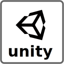

# GameHub
 

 
  

|  |  |  |
| ----------- | - | ----------- |
| 
[English](https://github.com/cafebazaar/Poolakey) / [فارسی](https://github.com/cafebazaar/Poolakey)
 |   | 
[English](https://github.com/cafebazaar/Poolakey) / [فارسی](https://github.com/cafebazaar/Poolakey) 
|

